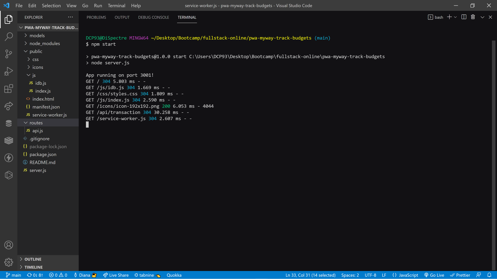
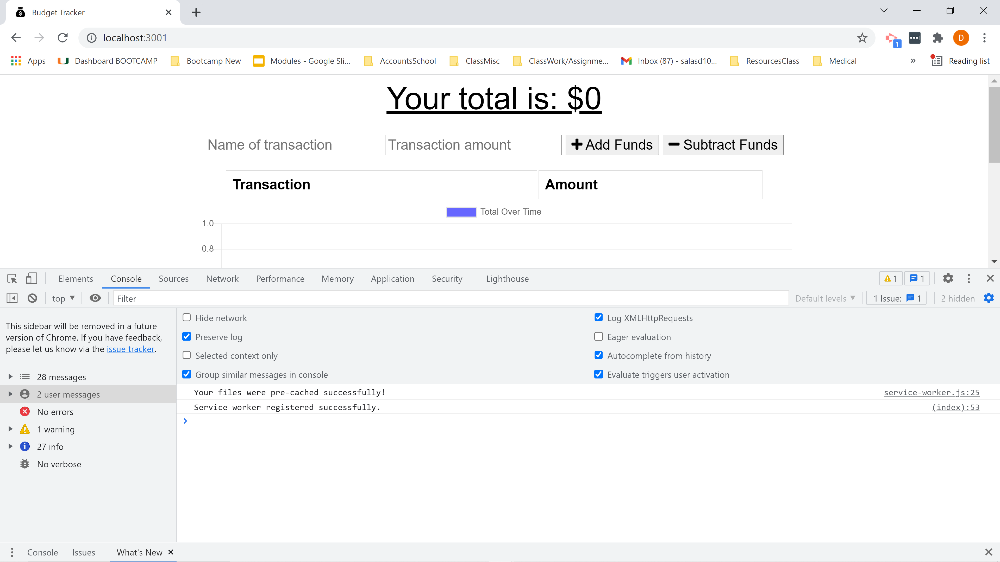
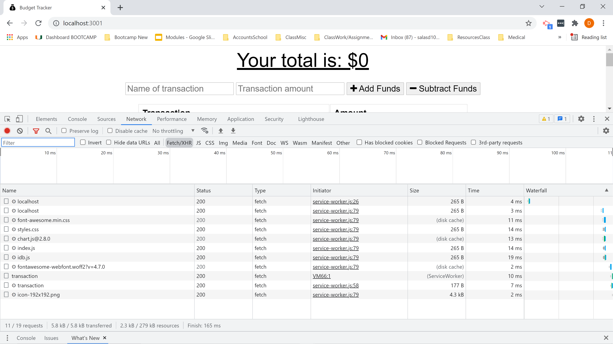
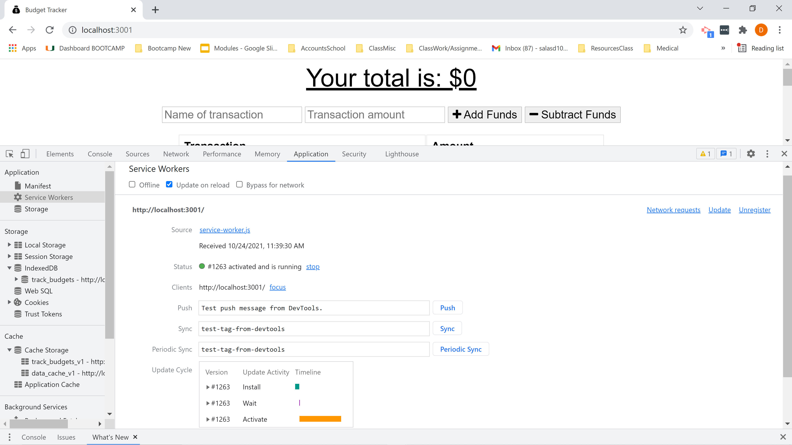
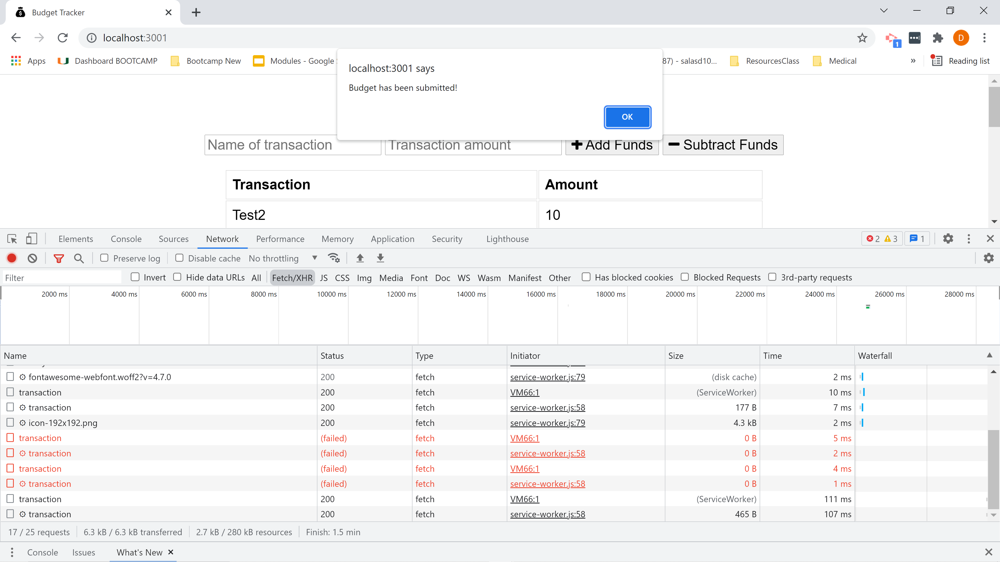
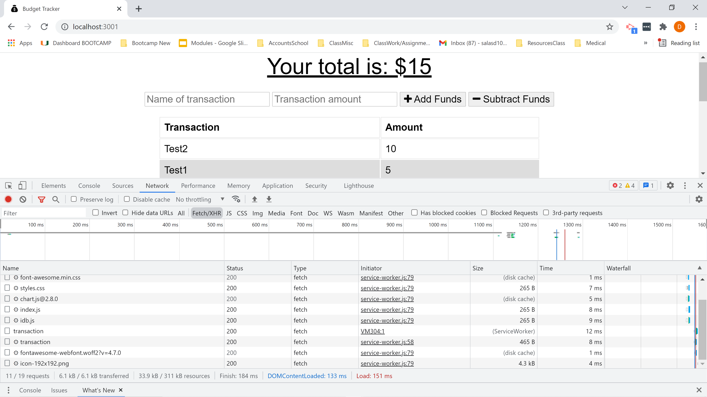
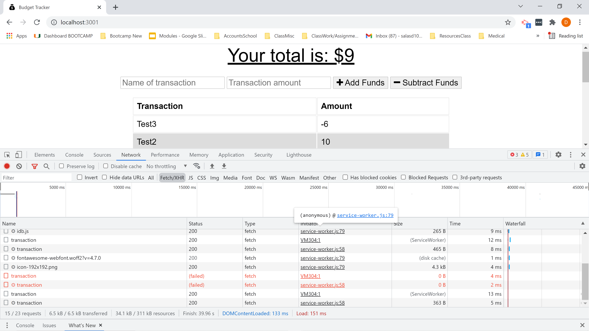
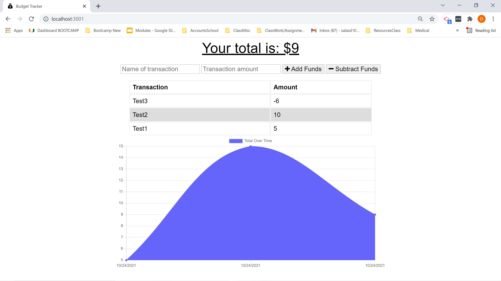

# pwa-myway-track-budgets


## Description

For challenge 19 of the UM Coding Bootcamp, I had to use MongoDB (NoSQL), Express.js, IndexedDB, Service Workers, and a Web Manifest to create a Progressive Web Application (PWA) Budget Tracker. This application is deployed on Heroku through GitHub and MongoDB Atlas.


## Table of Contents

* [Mock-Up](#mock-up)

* [Built-With](#built-with)

* [Installation](#installation)

* [Usage](#usage)

* [License](#license)

* [Contributing](#contributing)

* [Questions](#questions)

* [Deployed](#deployed)

* [Repository](#repository)


## Mock-Up











## Built-With

MongoDB (NoSQL), Express.js, IndexedDB, Service Workers, and Web Manifest


## Installation

To install necessary dependencies, run the following command:
```md
npm i
```

## Usage

To use this application, run the following commands:
```md
npm start

navigate to localhost:3001 in your browser

to check offline functionality, toggle the network to offline, submit a budget entry, then toggle the network to online
```

## License

This project is licensed under the GNU GPLv3 license.


## Contributing

Please contact the owner of the repository if you would like to contribute.


## Questions

If you have any questions about the repo, open an issue or contact me directly at salasd10418@gmail.com. You can find more of my work at [Github](https://github.com/salasd93).


## Deployment

https://trackbudgets.herokuapp.com/


## Repository

https://github.com/SalasD93/pwa-myway-track-budgets